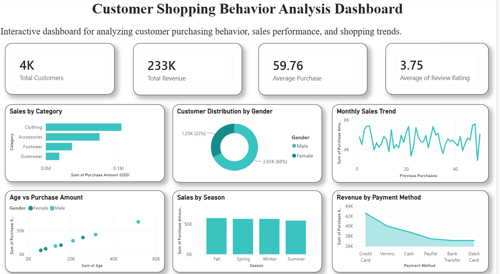

# Customer Shopping Behavior Analysis

## Project Overview
This project analyzes customer shopping behavior using SQL, Python, and Power BI. The objective is to understand customer purchasing patterns, sales performance, payment preferences, and seasonal shopping trends. The project includes data cleaning, exploratory data analysis (EDA), SQL-based business queries, and an interactive Power BI dashboard.

## Tools & Technologies
- Python
- Pandas
- Matplotlib
- SQL (MySQL)
- Power BI
- Jupyter Notebook

## Dataset
- Total Records: 3,900
- Total Columns: 19

## Project Workflow
1. Data Collection
2. Data Cleaning
3. Exploratory Data Analysis (EDA)
4. SQL Analysis
5. Power BI Dashboard
6. Business Insights

## Key Insights
- Total Customers: 3,900+
- Total Revenue: 233K
- Average Purchase Amount: 59.76
- Average Review Rating: 3.75
- Male Customers: 68%
- Female Customers: 32%
- Clothing category generated the highest sales.
- Customer purchases were analyzed across different seasons and payment methods.

## Files Included
- Customer_Shopping_Behavior_Analysis.ipynb
- Customer_Shopping_SQL_Analysis.sql
- Customer_Shopping_Behavior_Dashboard.pbix
- shopping_trends.csv
- shopping_trends_cleaned.csv
- Dashboard.png

## Dashboard Preview

## Author
**Bindu J**
